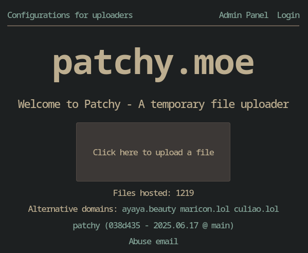

# Patchy

<!--
[](https://translate.codeberg.org/engage/patchy)
[](https://translate.codeberg.org/engage/patchy)
-->

Простой в размещении временный загрузчик файлов, который я сделал для замены
[Uguu](https://github.com/nokonoko/uguu), который сложно разместить из-за PHP.

Использует малый объем памяти, работает без JS, может использоваться в другом
программном обеспечении, таком как Chatterino2 и ShareX, и имеет другие функции,
перечисленные ниже

Действующий сервер этого ПО:
[patchy.moe](https://patchy.moe)

## Почему название Patchy?

Сначала я хотел назвать его "Patchouli" в честь
[Patchouli Knowledge](https://en.touhouwiki.net/wiki/Patchouli_Knowledge), но
уже были проекты, которые использовали это название, вероятно, по той же
причине, что и я (им нравится Touhou). Поэтому я выбрал **Patchy**,
так [Remi](https://en.touhouwiki.net/wiki/Remilia_Scarlet) называет Patchouli.

Итак, почему он называется Patchy и как это связано с сервисом загрузки файлов?
Подумайте об этом, Patchy - библиотекарь, возьмите книги как файлы, а Patchy как
ПО, которое ими управляет ;)


> <https://safebooru.org/index.php?page=post&s=view&id=905633>

## Скриншоты

### Javascript включен



### Javascript отключен


## Возможности

- Временная загрузка файлов, как в Uguu
- Ссылка для удаления файла (недоступна в версии без JS, пока я не найду способ)
- Поддержка Chatterino и ShareX
- Миниатюры для OpenGraph User-Agents (требуется установка `ffmpeg`,
  по умолчанию отключено)
- Ограничения скорости загрузки файлов (на основе IP-адреса)
- [Небольшой Admin API](./src/routes/admin/), который позволяет удалять файлы, собирать
  информацию о файлах, просматривать кэшированные файлы в ОЗУ и многое другое
  (необходимо включить в конфигурации)
- Поддержка Unix-сокетов, если вы не хотите
  иметь дело со всеми накладными расходами TCP
- Автоматическое определение протокола (HTTPS или HTTP)
- Кэширование файлов в памяти для снижения нагрузки на диск с использованием
  [LRU](https://en.wikipedia.org/wiki/Cache_replacement_policies#LRU), подробнее
  в [config.example.yml](./config/config.example.yml)
- Низкое потребление памяти: от 6 МБ в режиме простоя до 40 МБ,
  если файл загружается или извлекается.
  Это будет зависеть от вашего трафика, включен ли кэш и
  включено ли вычисление контрольных сумм.
- **Экспериментальная** поддержка S3 bucket (миниатюры OpenGraph недоступны,
  протестировано с использованием [Minio](https://min.io/))
- Поддержка локализации (в настоящее время поддерживаются только английский и испанский)
- Блокировка VPN (не совсем необходимо, но всё же,
  это хорошее дополнение) (**В разработке**)

## Планы

<https://codeberg.org/Fijxu/patchy/issues/9>

## Документация

[./docs](./docs/)

## Зеркала репозитория

Исходный код Patchy в настоящее время размещен тут:

- <https://git.nadeko.net/Fijxu/patchy>
- <https://codeberg.org/Fijxu/patchy>
- <https://app.radicle.xyz/nodes/iris.radicle.xyz/rad:z2n2ykznv2cwJZNTfbQUcvUECxPBq>

## Как разместить Patchy

### Контейнеры

#### Docker Compose / Podman Compose

- Создайте папку с любым именем
- Скачайте файл [docker-compose.yml](./docker-compose.yml) в папку,
  которую вы создали
- **Если вы используете docker**, создайте папку данных с помощью
  `mkdir ./data && sudo
  chown -R 10000:10000 ./data`
- Запустите его с помощью `docker compose up`,
  если используете Docker, или `podman compose up`, если используете Podman.
  Если всё работает нормально, вы можете добавить аргумент `-d` в конце,
  чтобы контейнер работал в фоновом режиме.

#### Kubernetes

### Нативная установка (компиляция самостоятельно)

- Создайте пользователя для загрузчика: `sudo useradd -u 10000 patchy` (вы можете
  заменить имя пользователя на любое другое)
- Клонируйте этот репозиторий, например, в `/opt/patchy`
- Установите Crystal и скомпилируйте загрузчик с помощью `shards build --release`
- Измените файл настроек `./config/config.yml` в соответствии с вашими потребностями.
- Настройте службу systemd для поддержания работы загрузчика. Скопируйте
  [patchy.service](./patchy.service) в `/etc/systemd/system/patchy.service`
- Выдайте права на папку `/opt/patchy` пользователю `patchy` с помощью
  `sudo chown -R 10000:10000 /opt/patchy`
- Запустите загрузчик с помощью `sudo systemctl start patchy`

> [!WARNING]
> Это не тестировалось, если у вас возникнут
> какие-либо проблемы, пожалуйста, откройте issue!

## Блок сервера NGINX

Предполагая, что вы уже используете NGINX и знаете,
как его использовать, вы можете использовать этот пример блока сервера.

```nginx
server {
  # You can keep the domain prefixed with `~.` if you want
  # to allow users to use any domain to upload and retrieve
  # files. Like xdxd.example.com or lolol.example.com
  # This will only work if you have a wildcard domain and certificate.
  server_name ~.example.com example.com;

  location / {
    proxy_pass http://127.0.0.1:8080;
    # This if you want to use a UNIX socket instead
    # proxy_pass http://unix:/tmp/patchy.sock;
    proxy_set_header X-Real-IP   $proxy_add_x_forwarded_for;
    proxy_set_header X-Forwarded-Proto $scheme;
    proxy_set_header X-Forwarded-Host  $host;
    proxy_pass_request_headers      on;
  }

  # This should be the size_limit value (from config.yml)
  client_max_body_size 512M;

  listen 443 ssl;
  http2 on;
}
```

<!--
## Переводы

Не стесняйтесь переводить Patchy на свой язык, если он здесь не поддерживается:
https://translate.codeberg.org/projects/patchy/patchy/ (требуется аккаунт Codeberg)

[](https://translate.codeberg.org/engage/patchy)
-->
