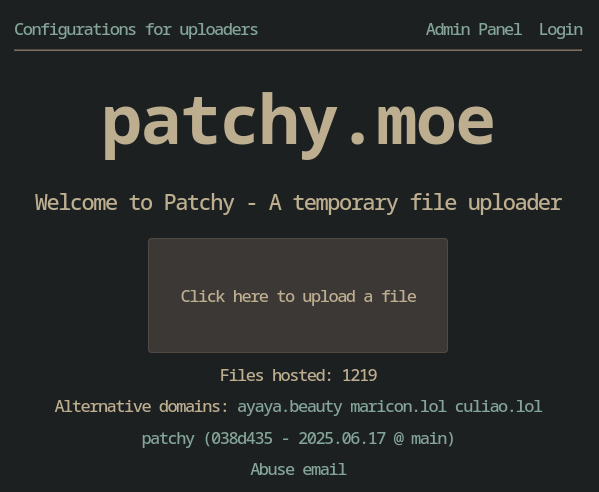

# Patchy

A temporary file uploader easy to host that I did to replace
[Uguu](https://github.com/nokonoko/uguu), which is not easy to host due to PHP.

Uses a low amount of memory, it works without JS, it can be used on other
software like Chatterino2 and ShareX and it has other features that are listed
bellow

There is an instance of this software running at
[ayaya.beauty](https://ayaya.beauty)

## Why is called Patchy?

At first I wanted to call it "Patchouli", from
[Patchouli Knowledge](https://en.touhouwiki.net/wiki/Patchouli_Knowledge), but
there was already some projects that already used that name, probably because of
the same reason as me (they like Touhou). So I went with **Patchy**, which is
how [Remi](https://en.touhouwiki.net/wiki/Remilia_Scarlet) calls Patchouli.

So, why is called Patchy and how it's related to a file uploader service? Think
about it, Patchy is a librarian, take the books as files, and Patchy as the
software that manages them ;)


> https://safebooru.org/index.php?page=post&s=view&id=905633

## Screenshots

### Javascript enabled



### Javascript disabled


## Features

- Temporary file uploads like Uguu
- File deletion link (not available on the noJS until I find a way)
- Chatterino and ShareX support
- Thumbnails for OpenGraph User-Agents (Requires `ffmpeg` to be installed,
  disabled by default)
- File upload rate limits (based on the IP address)
- [Small Admin API](./src/routes/admin/) that allows you to delete files, gather
  file information, see cached files on RAM and more (Needs to be enabled in the
  configuration)
- Unix socket support if you don't want to deal with all the TCP overhead
- Automatic protocol detection (HTTPS or HTTP)
- Cache files on memory to reduce stress on the drive using
  [LRU](https://en.wikipedia.org/wiki/Cache_replacement_policies#LRU), more
  information on [config.example.yml](./config/config.example.yml)
- Low memory usage: Between 6MB at idle and 25MB if a file is being uploaded or
  retrieved. It will depend of your traffic and if Cache is enabled
- **Experimental** S3 bucket support (OpenGraph thumbnails are not available,
  tested using [Minio](https://min.io/))

## TODO

- Admin panel for easy deletion of files and user management for authenticated
  uploads
- Authenticated upload
- Locale config to support different languages

## Hosting

### Containers

#### Docker Compose / Podman Compose

- Create a folder with the name you want
- Download the [docker-compose.yml](./docker-compose.yml) file into the folder
  you created
- **If you are using docker**, create the data folder using
  `mkdir ./data && sudo
  chown -R 10000:10000 ./data`
- Run it using `docker compose up` if using docker or `podman compose up` if
  using Podman. If it works fine, then you can append the `-d` argument next to
  leave the container running on the background

### Native (Compiling it yourself)

- Create a user for the uploader: `sudo useradd -u 10000 patchy` (you can
  replace the username with whatever you want)
- Clone this repository on something like `/opt/patchy`
- Install Crystal and compile the uploader using `shards build --release`
- Change the settings file `./config/config.yml` according to what you need.
- Setup a systemd service to keep the uploader running. Copy
  [patchy.service](./patchy.service) into `/etc/systemd/system/patchy.service`
- Give permissions to the `/opt/patchy` folder to the user `patchy` using
  `sudo chown -R 10000:10000 /opt/patchy`
- Start the uploader using `sudo systemctl start patchy`

> [!WARNING]
> This was not tested, if you have any issues with it, please open an issue!

#### Kubernetes

**TODO**

## NGINX Server block

Assuming you are already using NGINX and you know how to use it, you can use
this example server block.

```
server {
  # You can keep the domain prefixed with `~.` if you want
  # to allow users to use any domain to upload and retrieve
  # files. Like xdxd.example.com or lolol.example.com
  # This will only work if you have a wildcard domain and certificate.
  server_name ~.example.com example.com;

  location / {
    proxy_pass http://127.0.0.1:8080;
    # This if you want to use a UNIX socket instead
    #proxy_pass http://unix:/tmp/patchy.sock;
    proxy_set_header X-Real-IP   $proxy_add_x_forwarded_for;
    proxy_set_header X-Forwarded-Proto $scheme;
    proxy_set_header X-Forwarded-Host  $host;
    proxy_pass_request_headers      on;
  }

  # This should be the size_limit value (from config.yml)
  client_max_body_size 512M;

  listen 443 ssl;
  http2 on;
}
```
